# CI Configurations

All of the pipeline configurations are located at [`tools/ci`](tools/ci).

Because there is only one `.gitlab-ci.yml`, we are generating [downstream pipeline](https://docs.gitlab.com/ee/ci/pipelines/downstream_pipelines.html) for each use case.

## Pipelines

### Affected Pipeline (PR, Main, Release)

This pipeline is used to execute affected tasks on Nx project and use the [distribute tasks execution of Nx](https://nx.dev/nx-cloud/features/distribute-task-execution#distribute-task-execution-dte)

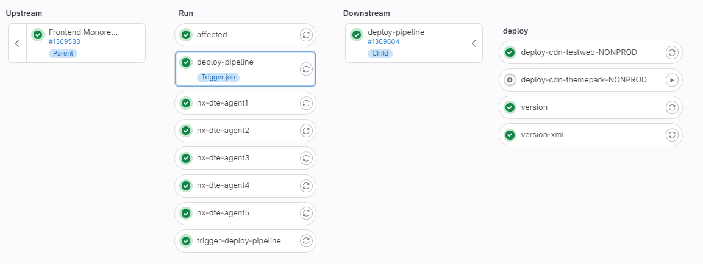

That pipeline will first check the formatting of the code by using Prettier.

Then it will execute targets like: build, lint, lint-styles, test, test-betslip, lint-betslip, integrity, scss-checks.

It will report all execution on the Nx cloud located at [https://nxcloud.dev.env.works/](https://nxcloud.dev.env.works/).

You can affect all projects by setting the env variable `AFFECTED_ALL` to `true`.

You can fallback to the configuration without Nx DTE by the env variable `NX_TASKS_RUNNER` to `local`.

When a project contains long tasks, you can add the tag `ci:long-tasks` to the project configuration tags to disable parallel execution.

### Disme Deploy Pipeline (PR, Main, Release and Manual)

This pipeline is responsible for building and deploying an application package to disme.

  
You need to run the respective start-{app} job.

  

    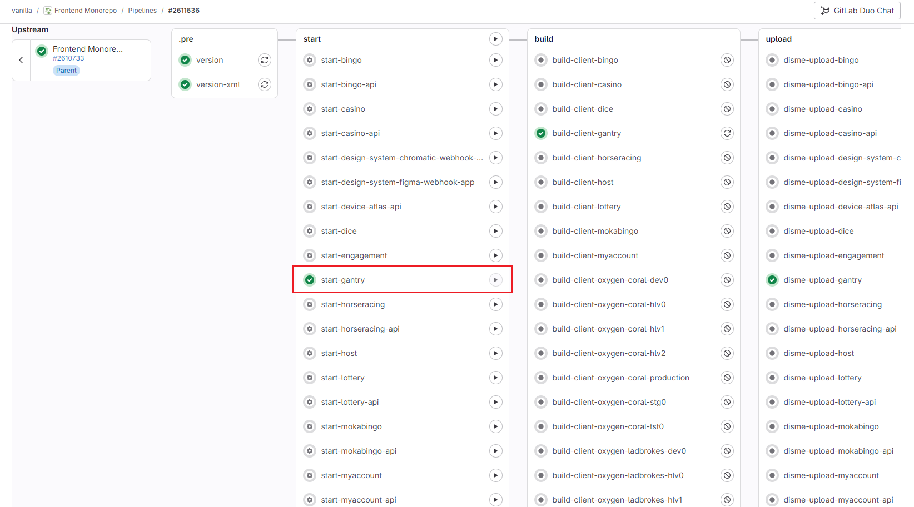
  

  
For disme-deploy job you may enter DISME_ENVIRONMENT and DISME_SERVER. You can check the default configuration <a href="https://vie.git.bwinparty.com/vanilla/monorepo/-/blob/main/tools/ci/disme/scripts/generate-disme-pipeline.ts"> here</a>.
  

  

    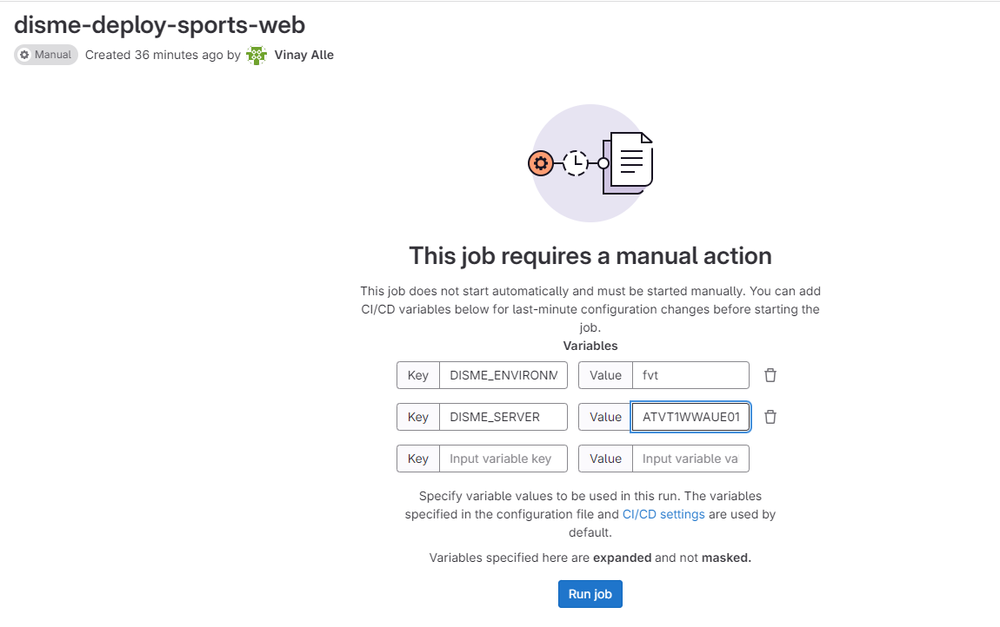
  

### Fortify Pipeline (Main, Release and Manual)

That pipeline is responsible for fortify build. You can run the respective fortify:{app} job.

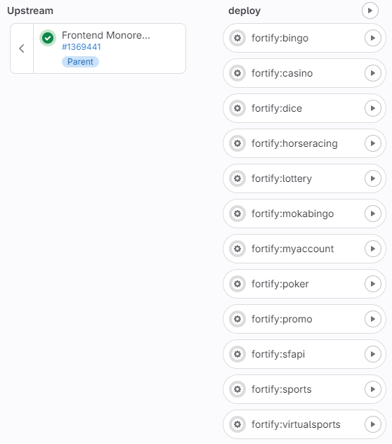

### Release Pipeline (Main and Manual)

This pipeline is used to release project that are releasable. More infos on the [Release Process](../../docs/release-guidelines/release-guidelines.md) documentation.

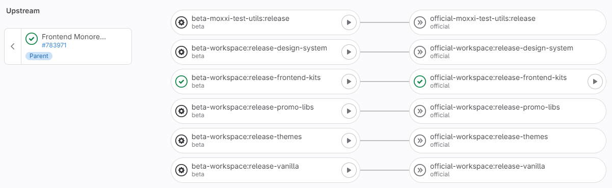

The list of jobs are generated dynamically by using a script [`generate-release-pipeline.ts`](../../tools/ci/release/scripts/generate-release-pipeline.ts) that will generate one job per releasable project.

### Review Deploy Pipeline (PR, Main, Release and Manual)

  
This pipeline is responsible for building, publishing and running a linux image of an application in kubernetes.

    

    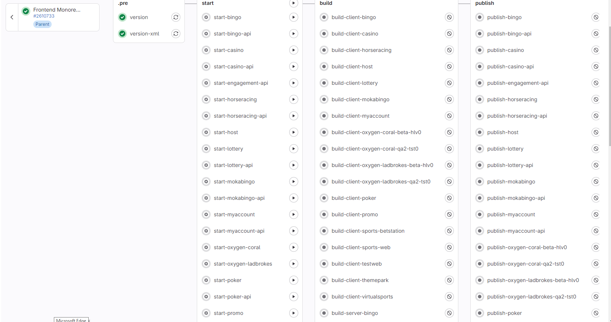
  

Detailed steps can be found [here](./review-deploy.md).

### Quality Pipeline (Main and Scheduled)

It is a scheduled pipeline that is responsible of running all long time jobs. It is responsible of monitoring the quality of the main branch.

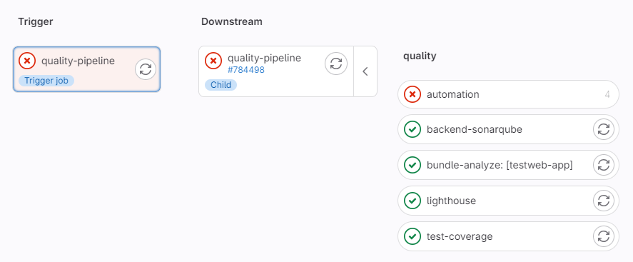

### Workspace Validation Pipeline (Main and Scheduled)

It is a scheduled pipeline that is running the `validate-workspace` generator every morning. More details on the doc of the [Workspace Validation](../../packages/migration-kit/src/workspace-validation/validate-workspace/README.md).

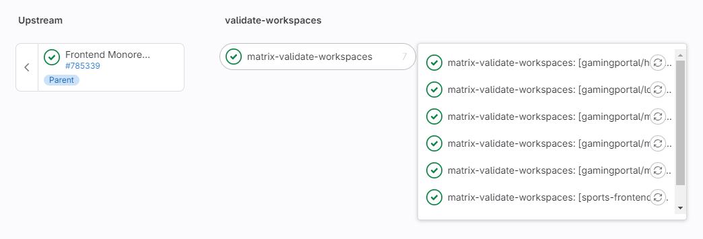

Then the result can be consulted on the report https://monorepo.vanilla.intranet/pipelines/workspace-validation/app/

## Specific Behaviours

### Refresh And Cache Node Modules

To improve pipeline performance, the `node_modules` is cached and we just shared to the jobs that needs it.

To be able to refresh the `node_modules`, a specific job is triggerred if the `yarn.lock` is modified trigger a job:

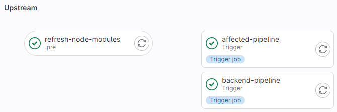

### Add Labels to MR

Each a PR is created, a list of [Gitlab labels](https://docs.gitlab.com/ee/user/project/labels.html) is added to the PR based on the [CODEOWNER](https://docs.gitlab.com/ee/user/project/codeowners/) file.

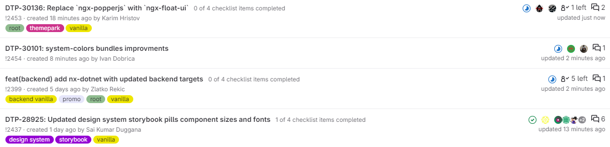

### Affected Deployment

At the end of the affected pipeline, you can choose to deploy your frontend code manually. This list of jobs is generated dynamically based on the affected applications.

For example here only the promo jobs were generated because only promo was affected:

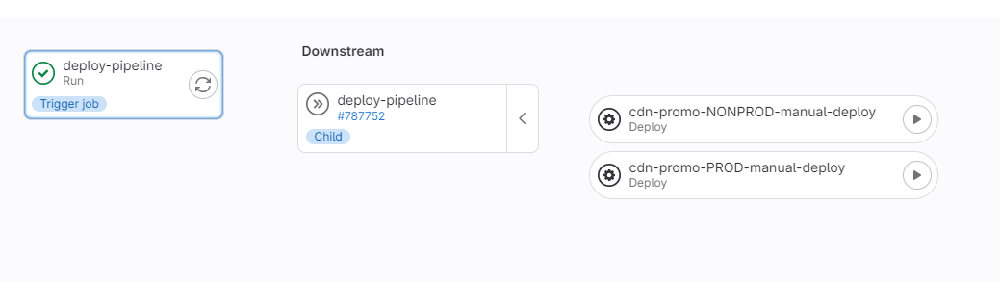

## Flows

### Stages

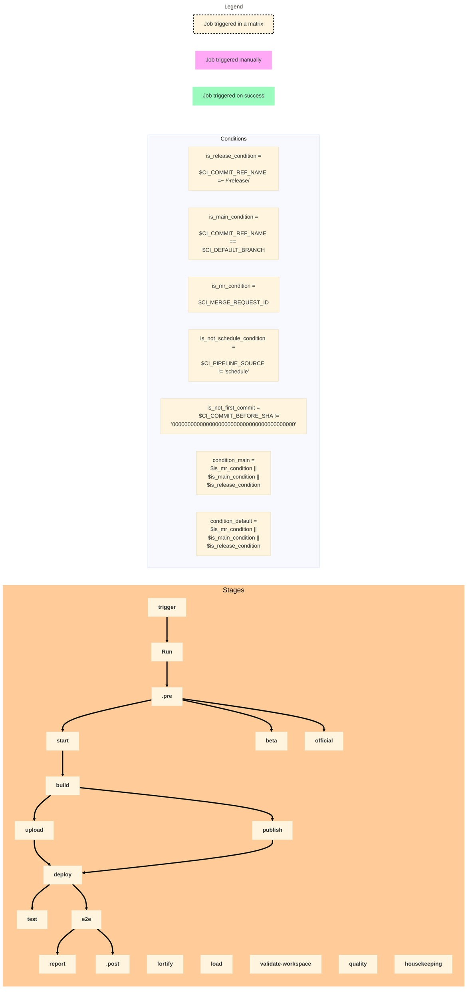

### Jobs

```mermaid
---
config:
    theme: base
    themeVariables:
        primaryColor: #ffcc66
        edgeLabelBackground: #cccccc
        tertiaryColor: #fffecb
    flowchart:
        wrap: true
---
graph TD
    %% Define jobs within each stage
    subgraph triggerJobs[Jobs in trigger stage]
        trigger-cdn-pipeline["`**trigger-cdn-pipeline**
        **if**: $condition_default
        **when**: manual`"]
        cdn-pipeline["`**cdn-pipeline**
        **needs**: trigger-cdn-pipeline
        **if**: $condition_default`"]

        trigger-e2e-pipeline["`**trigger-e2e-pipeline**
        **if**: $condition_default
        **when**: manual`"]
        e2e-pipeline["`**e2e-pipeline**
        **needs**: trigger-e2e-pipeline
        **if**: $condition_default`"]

        trigger-release-pipeline["`**trigger-release-pipeline**
        **if**: $condition_default
        **when**: manual`"]
        release-pipeline["`**release-pipeline**
        **needs**:
        trigger-release-pipeline
        **if**: $condition_default`"]

        trigger-disme-pipeline["`**trigger-disme-pipeline**
        **if**: $condition_default
        **when**: manual`"]
        disme-pipeline["`**disme-pipeline**
        **needs**:
        trigger-disme-pipeline
        **if**: $condition_default`"]

        trigger-fortify-pipeline["`**trigger-fortify-pipeline**
        **if**: $condition_default
        **when**: manual`"]
        fortify-pipeline["`**fortify-pipeline**
        **needs**:
        trigger-fortify-pipeline
        **if**: $condition_default`"]

        trigger-review-pipeline["`**trigger-review-pipeline**
        **if**: $condition_default
        **when**: manual`"]
        review-pipeline["`**review-pipeline**
        **needs**:
        trigger-review-pipeline
        **if**: $condition_default`"]

        trigger-load-pipeline["`**trigger-load-pipeline**
        **if**: $condition_default
        **when**: manual`"]
        load-pipeline["`**load-pipeline**
        **needs**:
        trigger-load-pipeline
        **if**: $condition_default`"]

        trigger-sonar-pipeline["`**trigger-sonar-pipeline**
        **if**: $condition_default
        **when**: on_success`"]
        sonar-pipeline["`**sonar-pipeline**
        **needs**: affected,trigger-sonar-pipeline
        **if**: $condition_default
        **when**: on_success`"]

        trigger-cpu-report-pipeline["`
        **trigger-cpu-
        report-pipeline**
        **if**: $is_mr_condition`"]
        cpu-report-pipeline["`**cpu-report-pipeline**
        **needs**:
        trigger-cpu-report-pipeline
        **if**: $is_mr_condition`"]


        workspace-validation-pipeline["`**workspace-validation-pipeline**`"]

        housekeeping-pipeline["`**housekeeping-pipeline**`"]

        quality-pipeline["`**quality-pipeline**`"]


        affected-backend["`**affected-backend**
        **if**: $condition_default
        **changes**: backend/`"]

        affected-pipeline["`**affected-pipeline**
        **if**: ($is_mr_condition
        || $is_release_condition) &&
        $is_not_schedule_condition
        **changes**: 'packages/,
        backend/, tools/, *'`"]

        main-affected-pipeline["`**main-affected-pipeline**
        **if**: $is_main_condition &&
        $is_not_schedule_condition
        **changes**: 'packages/,
        backend/, tools/, *'`"]

        add-tags-to-mr["`**add-tags-to-mr**
        **if**: $is_mr_condition`"]
    end

    subgraph runJobs[Jobs in Run stage]
        nx-dte-agentN["`**nx-dte-agent-N**
        **if**: $condition_main`"]
        affected["`**affected**
        **if**: $condition_main`"]

        trigger-deploy-pipeline["`**trigger-deploy-pipeline**
        **if**: $condition_main`"]

        deploy-pipeline["`**deploy-pipeline**
        **needs**: affected,
        affected-test-storybook,
        trigger-deploy-pipeline
        **if**: $condition_main`"]
    end

    subgraph preJobs[Jobs in .pre stage]
        version["`**version**
        **if**: $condition_main`"]
        version-xml["`**version-xml**
        **needs**: version`"]
        health-spa["`**health-spa**
        **if**: $condition_main`"]
    end

    subgraph startJobs[Jobs in start stage]
        start-nxproject["`**start-nxproject**
        **if**: $condition_main`"]
        start-nxproject-api["`**start-nxproject-api**
        **if**: $condition_main`"]
    end

    subgraph buildJobs[Jobs in build stage]
        build-server-nxproject["`**build-server-nxproject**
        **needs**: version,
        version-xml,
        health-spa,
        start-nxproject
        **if**: $condition_main`"]

        build-client-nxproject-app["`**build-client-nxproject-app**
        **needs**: start-nxproject
        **if**: $condition_main`"]

        build-server-nxproject-api["`**build-server-nxproject-api**
        **needs**: version,
        version-xml,
        health-spa,
        start-nxproject-api
        **if**: $condition_main`"]
    end

    subgraph uploadJobs[Jobs in upload stage]
        disme-upload-legacy-nxproject["`**disme-upload-
        legacy-nxproject**
        **needs**: version,
        health-spa,
        build-server-nxproject,
        build-client-nxproject-app
        **if**: $condition_main
        **when**: on_success`"]

        disme-upload-nxproject["`**disme-upload-nxproject**
        **needs**: version,
        health-spa,
        build-server-nxproject,
        build-client-nxproject-app
        **if**: $condition_main
        **when**: on_success`"]

    end

    subgraph deployJobs[Jobs in deploy stage]
        deploy-nxproject["`**deploy-nxproject**
        **if**: $condition_main`"]

        deploy-nxproject-api["`**deploy-nxproject-api**
        **if**: $condition_main`"]

        storybook-nxproject-deploy["`**storybook-
        nxproject-deploy**
        **needs**:
        affected-test-storybook`"]

        storybook-nxproject-note["`**storybook-nxproject-note**
        **needs**:
        storybook-nxproject-deploy
        **if**:
        $is_mr_condition ||
        $is_main_condition`"]

        deploy-cdn-nxproject-nonprod["`**deploy-cdn-
        nxproject-nonprod**
        **needs**: version,affected
        **when**: manual
        **if**: $condition_main`"]

        deploy-cdn-nxproject-prod["`**deploy-cdn-
        nxproject-prod**
        **needs**: version,affected
        **when**: manual
        **if**: $is_release_condition`"]

        disme-deploy-legacy-nxproject["`**disme-deploy-
        legacy-nxproject**
        **needs**:
        disme-upload-
        legacy-nxproject
        **when**: manual`"]

        disme-deploy-nxproject["`**disme-deploy-nxproject**
        **needs**:
        disme-upload-nxproject
        **when**: manual`"]

        start-user-flows-nxproject["`**start-user-flows-nxproject**
        **needs**:
        deploy-nxproject
        **if**: userFlowPaths
        **when**: manual`"]
    end

    subgraph publishJobs[Jobs in publish stage]
        publish-nxproject["`**publish-nxproject**
        **needs**: version,
        build-server-nxproject,
        build-client-nxproject-app
        **if**: $condition_main`"]

        publish-nxproject-api["`**publish-nxproject-api**
        **needs**: version,
        build-server-nxproject-api
        **if**: $condition_main`"]
    end

    subgraph e2eJobs[Jobs in e2e stage]
        trigger-nxproject-e2e-pipeline["`**trigger-nxproject
        -e2e-pipeline**
        **needs**: deploy-nxproject
        **if**: $condition_main`"]

        nxproject-e2e-pipeline["`**nxproject-e2e-pipeline**
        **needs**: trigger-nxproject-
        e2e-pipeline
        **if**: $condition_main`"]

        affected-test-storybook["`**affected-test-storybook**
        **needs**: affected
        **if**: $condition_main`"]

        e2e-nxproject["`**e2e-nxproject**
        **when**: manual`"]

        %%  dynamically generated based on the e2e (playwright plugin) task configuration
        e2e-project-name["`**e2e-project-name**
        **when**: manual`"]
    end

    subgraph reportJobs[Jobs in report stage]
        merge-reports["`**merge-reports**`"]
    end

    subgraph betaJobs[Jobs in beta stage]
        beta-backend["`**beta-backend**
        **needs**: health-spa
        **if**: $condition_main
        **when**: manual`"]

        beta-nxproject:release["`**beta-nxproject:release**
        **when**: manual`"]
    end

    subgraph officialJobs[Jobs in official stage]
        official-backend["`**official-backend**
        **needs**: health-spa
        **if**: $condition_main
        **when**: manual`"]

        official-nxproject:release["`**official-nxproject:release**
        **needs**:
        beta-nxproject:release
        **when**: manual`"]
    end

    subgraph postJobs[Jobs in .post stage]
        start-jenkins-nxproject["`**start-jenkins-nxproject**
        **needs**: deploy-nxproject
        **if**: afterDeployJob == 'jenkins'
        **when**: manual`"]

        cleanup-nxproject["`**cleanup-nxproject**
        **needs**: deploy-nxproject
        **if**: $condition_main`"]

        cleanup-nxproject-api["`**cleanup-nxproject-api**
        **needs**: deploy-nxproject-api
        **if**: $condition_main`"]
    end

    %% don/t know which stage they belong to. Run?
    subgraph sonarJobs
        sonar-frontend["`**sonar-frontend**
        **needs**: affected
        **if**: $condition_main
        **when**: on_success`"]

        sonar-backend["`**sonar-backend**
        **if**: $condition_main
        **when**: on_success`"]
    end

    subgraph fortifyJobs[Jobs in fortify stage]
        fortify:backendproject["`**fortify:backendproject**
        **when**: manual`"]
    end

    subgraph workspaceValidationJobs[Jobs in workspace-validation stage]
      matrix-validate-workspaces["`**matrix-validate-workspaces**`"]
    %% matrix-validate-workspaces:[entain/oxygen/coralsports]
    end

    subgraph qualityJobs[Jobs in quality stage]
        lighthouse["`**lighthouse**`"]
        esbuild-bundle-analyze["`**esbuild-bundle-analyze**`"]
    end

    %% subgraph housekeepingJobs[Jobs in housekeeping stage]
    %% end


    %% Dependencies among jobs

    %% Internal dependencies in Trigger stage
    main-affected-pipeline --> |contains| trigger-cpu-report-pipeline
    main-affected-pipeline --> |contains| trigger-deploy-pipeline
    main-affected-pipeline --> |contains| trigger-sonar-pipeline
    affected-pipeline --> |contains| trigger-cpu-report-pipeline
    affected-pipeline --> |contains| trigger-deploy-pipeline
    affected-pipeline --> |contains| trigger-sonar-pipeline

    trigger-cdn-pipeline -->|needs| cdn-pipeline
    trigger-cpu-report-pipeline -->|needs| cpu-report-pipeline
    trigger-disme-pipeline -->|needs| disme-pipeline
    trigger-e2e-pipeline -->|needs| e2e-pipeline
    trigger-fortify-pipeline -->|needs| fortify-pipeline
    trigger-load-pipeline -->|needs| load-pipeline
    trigger-release-pipeline -->|needs| release-pipeline
    trigger-review-pipeline -->|needs| review-pipeline
    trigger-sonar-pipeline -->|needs| sonar-pipeline

    health-spa -->|needs| build-server-nxproject
    version -->|needs| build-server-nxproject
    version-xml -->|needs| build-server-nxproject
    start-nxproject -->|needs| build-server-nxproject
    start-nxproject -->|needs| build-client-nxproject-app

    health-spa -->|needs| build-server-nxproject-api
    version -->|needs| build-server-nxproject-api
    version-xml -->|needs| build-server-nxproject-api
    start-nxproject-api -->|needs| build-server-nxproject-api

    build-server-nxproject -->|needs| publish-nxproject
    build-client-nxproject-app -->|needs| publish-nxproject
    publish-nxproject -->|needs| deploy-nxproject
    deploy-nxproject -->|needs| trigger-nxproject-e2e-pipeline
    trigger-nxproject-e2e-pipeline -->|needs| nxproject-e2e-pipeline
    build-server-nxproject-api -->|needs| publish-nxproject-api
    publish-nxproject-api -->|needs| deploy-nxproject-api

    affected-test-storybook -->|needs| storybook-nxproject-deploy
    storybook-nxproject-deploy -->|needs| storybook-nxproject-note
    version -->|needs| deploy-cdn-nxproject-nonprod
    version -->|needs| deploy-cdn-nxproject-prod
    affected -->|needs| deploy-cdn-nxproject-nonprod
    affected -->|needs| deploy-cdn-nxproject-prod
    deploy-nxproject -->|needs| cleanup-nxproject
    deploy-nxproject-api -->|needs| cleanup-nxproject-api
    deploy-nxproject -->|needs| start-jenkins-nxproject
    deploy-nxproject -->|needs| start-user-flows-nxproject

    trigger-deploy-pipeline-->|needs| deploy-pipeline
    affected-test-storybook -->|needs| deploy-pipeline

    e2eJobs ~~~ reportJobs

    build-server-nxproject -->|needs| disme-upload-legacy-nxproject
    build-client-nxproject-app -->|needs| disme-upload-legacy-nxproject
    disme-upload-legacy-nxproject -->|needs| disme-deploy-legacy-nxproject
    build-server-nxproject -->|needs| disme-upload-nxproject
    build-client-nxproject-app -->|needs| disme-upload-nxproject
    disme-upload-nxproject -->|needs| disme-deploy-nxproject

    health-spa -->|needs| beta-backend
    health-spa -->|needs| official-backend
    beta-nxproject:release -->|needs| official-nxproject:release

    %% Parallel job dependencies
    affected -.->|needs| cdn-pipeline & e2e-pipeline & deploy-pipeline & release-pipeline & disme-pipeline & fortify-pipeline & review-pipeline & load-pipeline & sonar-pipeline & sonar-frontend & affected-test-storybook

    nx-dte-agentN -.-> |runs| affected
    %% Triggered jobs
    %% disme-pipeline ==>|triggers| start-nxproject
    %% review-pipeline ==>|triggers| start-nxproject
    %% release-pipeline ==>|triggers| beta-backend
    %% release-pipeline ==>|triggers| beta-nxproject:release
    sonar-pipeline ==>|triggers| sonar-frontend
    sonar-pipeline ==>|triggers| sonar-backend
    fortify-pipeline ==>|triggers| fortify:backendproject
    workspace-validation-pipeline ==> |triggers| matrix-validate-workspaces
    quality-pipeline ==>|triggers| lighthouse & esbuild-bundle-analyze

    %% Styling for clarity
    classDef stages fill:#ffcc99,stroke:#000,stroke-width:0px,font-size: 20px
    classDef jobs fill:#66ccff,stroke:#000,stroke-width:0px
    classDef manual fill:#ffa8f6,stroke:#000,stroke-width:0px
    classDef onsuccess fill:#9bfabe,stroke:#000,stroke-width:0px
    classDef matrix stroke:#000,stroke-width:2px,stroke-dasharray:4

    class matrix matrix
    class manual manual
    class on_success onsuccess
    class Stages stages
    class triggerJobs,runJobs,preJobs,deployJobs,testJobs,startJobs,buildJobs,uploadJobs,publishJobs jobs
    class betaJobs,officialJobs,e2eJobs,reportJobs,postJobs,fortifyJobs, jobs
    class workspaceValidationJobs,qualityJobs jobs

    class trigger-cdn-pipeline,trigger-disme-pipeline,trigger-e2e-pipeline,trigger-fortify-pipeline,trigger-load-pipeline,trigger-review-pipeline,trigger-release-pipeline manual
    class deploy-cdn-nxproject-nonprod,deploy-cdn-nxproject-prod,disme-deploy-legacy-nxproject,disme-deploy-nxproject manual
    class beta-backend,official-backend,beta-nxproject:release,official-nxproject:release manual
    class start-jenkins-nxproject,start-user-flows-nxproject,e2e-nxproject,e2e-project-name,fortify:backendproject manual

    class start-nxproject,start-nxproject-api,build-server-nxproject,build-server-nxproject-api,build-client-nxproject-app matrix
    class publish-nxproject,publish-nxproject-api,disme-upload-legacy-nxproject,disme-upload-nxproject,disme-deploy-legacy-nxproject,disme-deploy-nxproject matrix
    class deploy-nxproject,deploy-nxproject-api,deploy-cdn-nxproject-nonprod,deploy-cdn-nxproject-prod,cleanup-nxproject,cleanup-nxproject-api matrix
    class storybook-nxproject-deploy,storybook-nxproject-note,trigger-nxproject-e2e-pipeline,nxproject-e2e-pipeline matrix
    class beta-nxproject:release,official-nxproject:release,fortify:backendproject matrix
    class start-jenkins-nxproject,start-user-flows-nxproject,e2e-nxproject,e2e-project-name matrix
    class matrix-validate-workspaces matrix

    class disme-upload-legacy-nxproject,disme-upload-nxproject,trigger-sonar-pipeline,sonar-pipeline,sonar-frontend,sonar-backend onsuccess
```
