# Review Pipeline

You can deploy the apps to a Kubernetes cluster from the pipeline. Here are the steps that you need to follow:

1. Trigger Review Pipeline

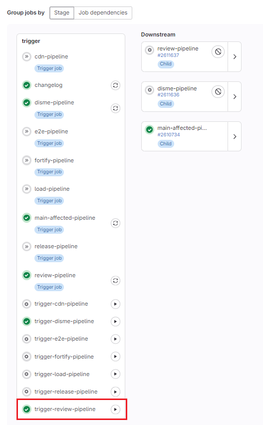

2. Open review deploy pipeline using one of the 3 options below

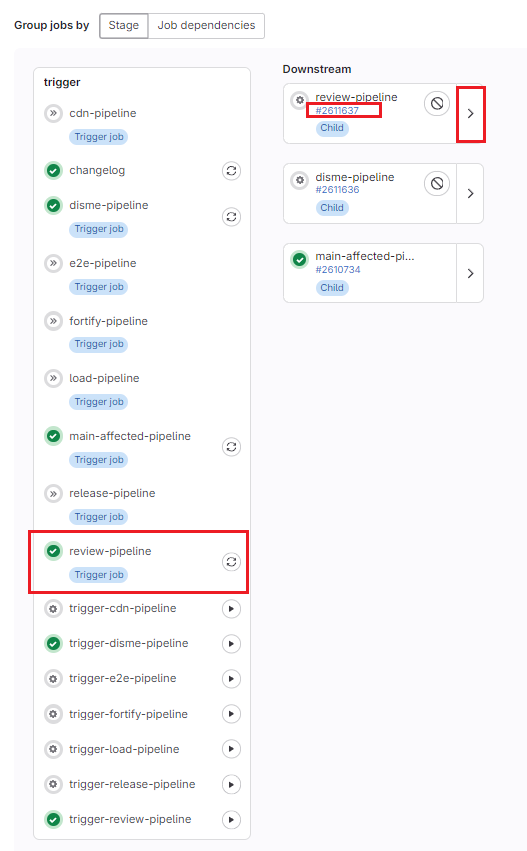

3. Start Review Deploy for an application

This builds and publishes to the artifactory an image of the chosen application.

You should wait for version, version-xml to be able to run any start job

The following jobs are triggered: build-client-{app} and build-server-{app} in parallel, publish-{app} starts after the previous 2 are done.

**IMPORTANT:** You can not proceed to step 4 until all the respective jobs are finished.

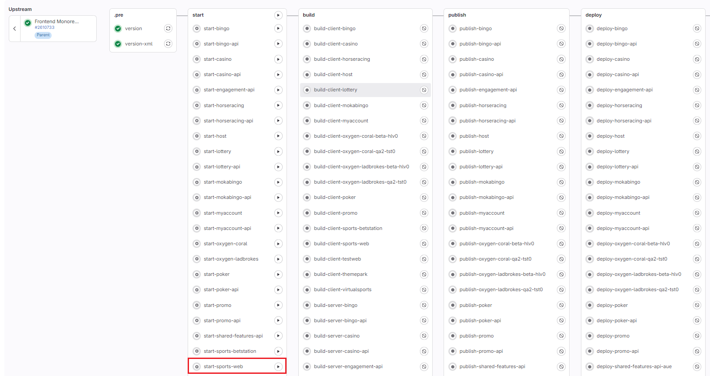

4. Deploy an application (Manual)

Please make sure the job can be started

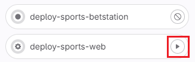

By default this will deploy with default environment aue which means that this instance will get the configs from dynacon for aue environment. You can change this by passing ENVIRONMENT variable to the job.

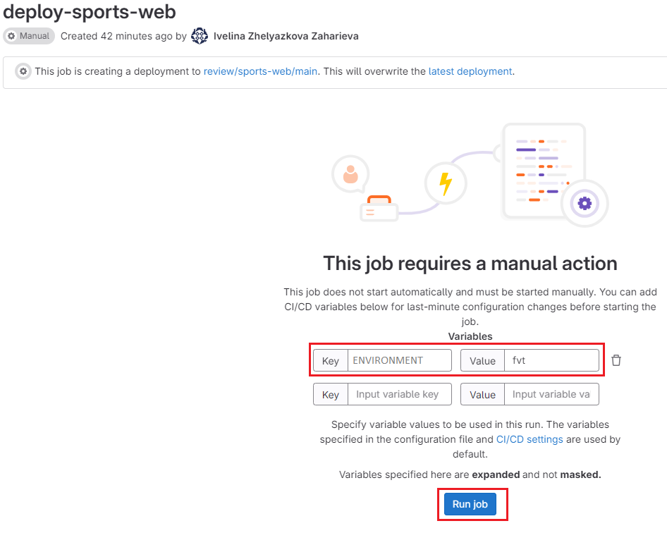

After the first run you can change the ENVIRONMENT variable using Update CI/CD variables

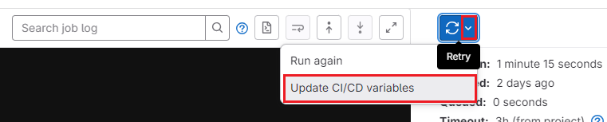

You can use any of the configs defined in dynacon. **devprod or beta are not supported currently!!!** You can deploy to only one environment from one branch for now. If you need to deploy to AUE to run automation tests for example you need to re-run the job passing the expected environment variable.

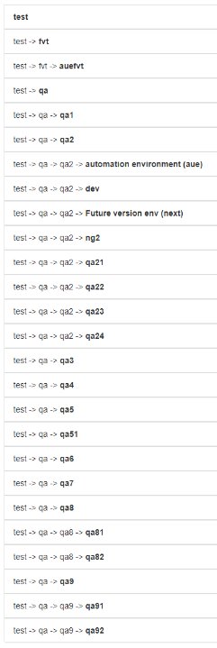

5. After successful deployment you will see a list of urls in the job output.

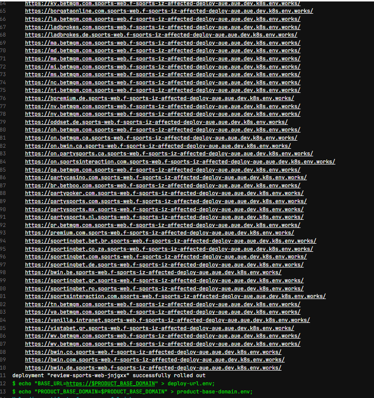

This list can be modified [here](../../tools/ci/review/scripts/review.config.ts#L30). All applications use the same list.

For betstation the list is [here](../../tools/ci/review/scripts/review.config.ts#L158).

The job uploads artifacts product-base-domain.env and deploy-url.env which contains the base domain and url of the deployment.

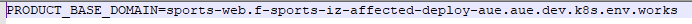

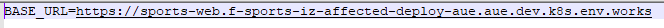

**IMPORTANT:** You would notice that some of the URL-s are pointing to shared-features api instead of the proper K8s environment, i.e. the label's logo. 

In order to have the proper URLs you need to set a request header x-smart-url-<product> with a value the url of the deployment present in deploy-url.env. Here are examples:

x-smart-url-sports       bwin.com.sports-web.f-sports-garuda-spo-113743-kib-greyhoundsracing-tracking.aue.dev.k8s.env.works

x-smart-url-poker        bwin.com.poker.f-sports-garuda-spo-113743-kib-greyhoundsracing-tracking.aue.dev.k8s.env.works

x-smart-url-casino       bwin.com.casino.f-sports-garuda-spo-113743-kib-greyhoundsracing-tracking.aue.dev.k8s.env.works

6. Stop deployment (Automatic, Manual)

The instance will be auto stopped after 8 hours. If you don't need the deployment anymore you can stop it manually from cleanup-{app} job.

**IMPORTANT:** Please make sure you enter the same ENVIRONMENT value as the one used for deploy-{app} job.

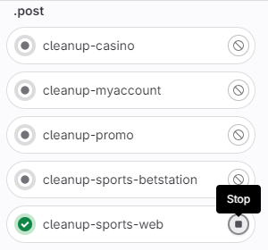
