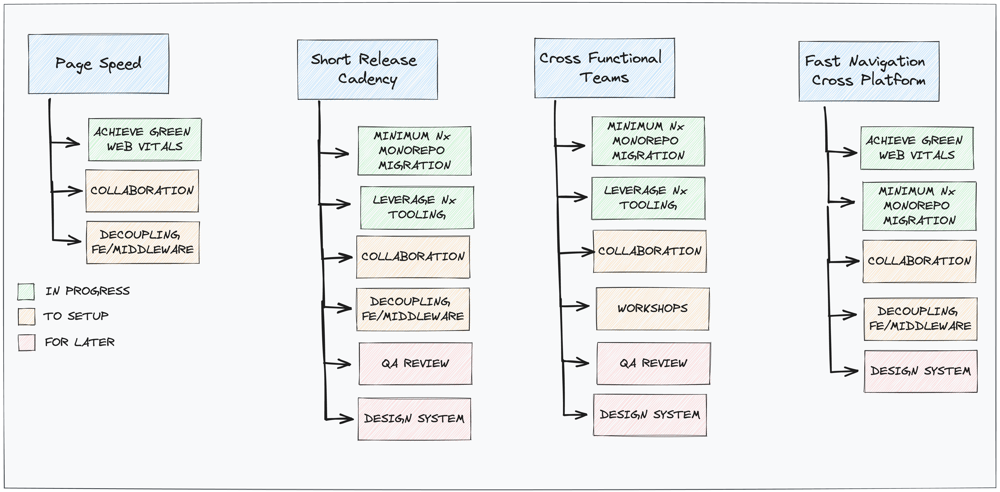
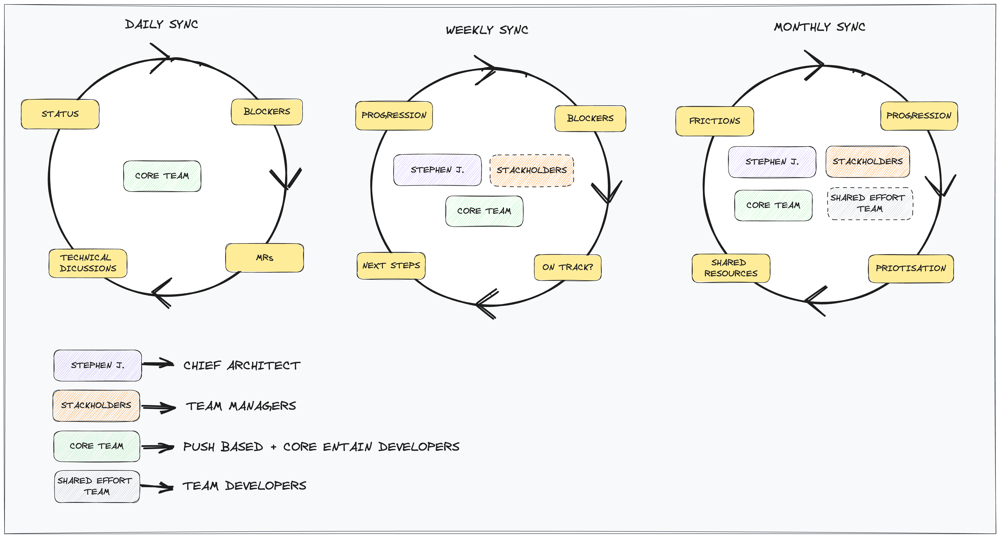
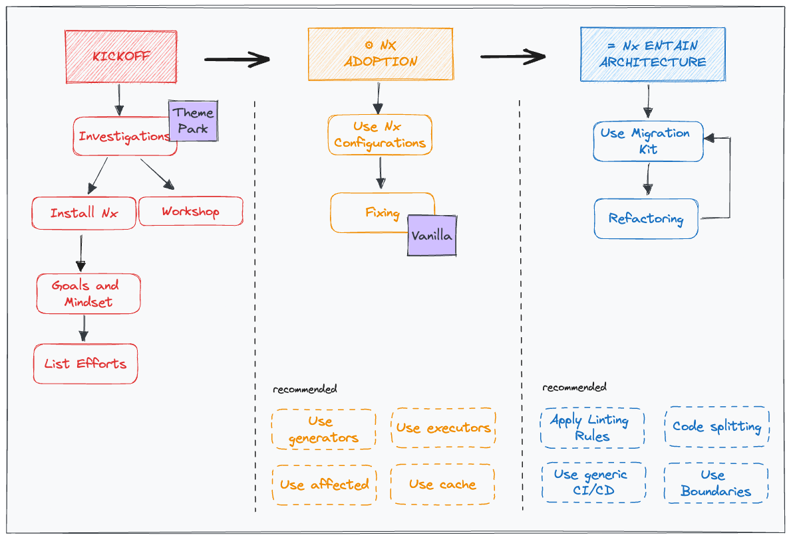
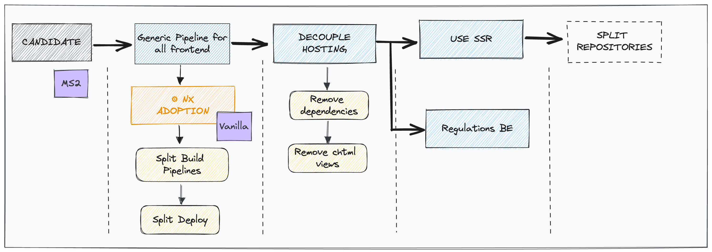
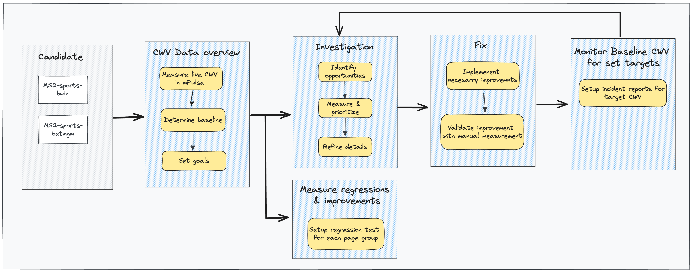
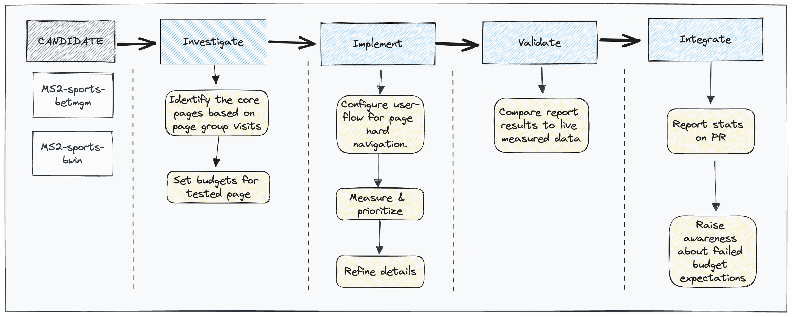
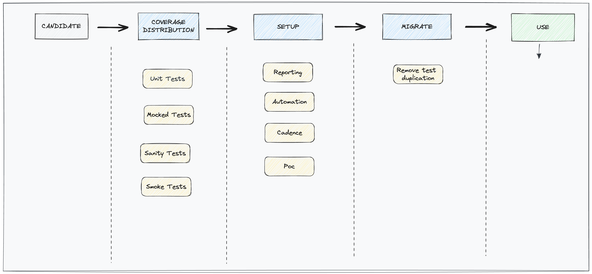
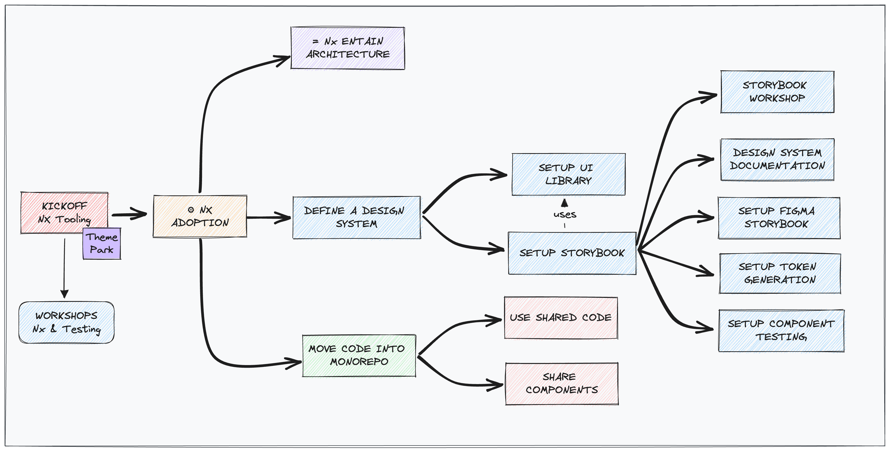

# Global Strategy

## Pre Analysis

The global strategy is a result of developers' feedback, workshops, and a Push-Based audit.

> More detailed insights can be found in the [pre-nx-analysis.pdf](./pdf/pre-nx-analysis.pdf) document

## Problematics and Solutions/Strategies

Several problematics were identified during the pre-analysis phase, and various solutions are being considered.

> These solutions are outlined in the [nx-migration-goals.pdf](./pdf/nx-migration-goals.pdf) document

The summary of possible solutions for each problematic is described below:

## Collaboration
The organization has set up meetings to ensure good collaboration between all parties involved.

The collaboration plan is illustrated below:

## Architecture Solutions:

The organization's target architecture focuses on using the [Nx Framework](https://nx.dev/) approach, which is expected to address many of the identified problematics.

> More details about this architecture can be found in the [nx-architecture.pdf](./pdf/nx-architecture.pdf) document.

### Leverage Nx Tooling

This solution path aims to benefit from using Nx tooling to achieve a **short release cadency** and encourage **cross-functional teams**.

Leveraging Nx tooling will:

* Improve release cadency by aligning code and processes, reducing duplication, and streamlining development.
* Speed up CI/CD with Nx Caching and Affected Build, providing a better developer experience and catching bugs earlier.
* Enable cross-functional teams through a Migration Kit for Nx adoption and code alignment, along with a shared Development Kit for common configurations.
* Encourage open discussions and collaboration between teams.

The process steps for this path are presented below:

### Entain Monorepo

This solution path involves utilizing Nx tooling to achieve a **short release cadency**, promote **cross-functional teams** and allow a **fast navigation cross platform** by adopting a minimum monorepo approach.

Adopting a monorepo approach will:

* Improve release cadency by centralizing code sharing and optimizing build times with Nx tooling.
* Enable cross-functional teams by facilitating collaboration through shared code and open discussions within the monorepo.
* Enhance fast navigation cross-platform by creating common bundles using Nx.

The process steps for this path are presented below:

### Decoupling Frontend/Middleware

The organization is considering decoupling the frontend and middleware to address certain architectural issues.

Decoupling frontend and middleware will:

* Improve page speed by reducing dependency on backend resources and enhancing frontend loading.
* Enable cross-functional teams with separate releases for faster updates, reduced dependencies, and more independence in regulations.
* Improve fast navigation cross-platform by utilizing common bundles through Nx.

The idea is described below:

## Performance Solutions

The organization is focusing on performance-related solutions to achieve green web vitals and perform CWV regression testing.

Code improvement efforts will:

* Improve page speed and achieve green web vitals by optimizing code and assets.
* Enhance release cadency by reducing bugs and improving application quality.
* Improve fast navigation cross-platform with faster page load times through code optimization.

The strategies for achieving these performance goals are described in the processes below:

### Achieve Green Web Vitals

### CWV Regression Testing

## To Be Discussed Solutions

Two solutions that are still in the discussion phase are the "QA Review" and the "Design System." The potential benefits and details of these solutions are yet to be explored further.

### QA Review

### Design System

