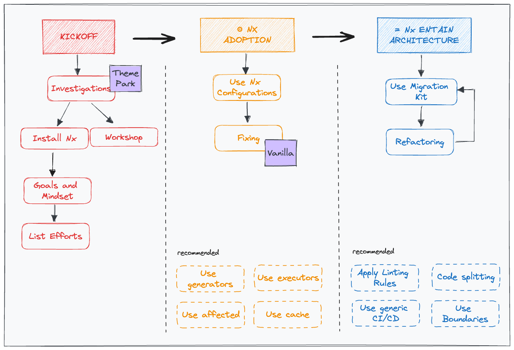

# Leverage Nx Tooling

The product migration is a crucial part of our larger strategy aimed at enhancing the quality and speed of  product development. To understand the comprehensive plan, please refer to the [Global Strategy Documentation](https://vie.git.bwinparty.com/vanilla/monorepo/-/blob/main/docs/global-strategy/global-strategy.md).

By leveraging **Internal Nx Framework**, we can align projects with the latest technology stack, code quality standards, and best practices. Additionally, we can merge them into a monorepo, providing significant advantages in terms of code-sharing, module boundaries, linting rules, TSC configuration, and optimized CI/CD processes, including publishing and release management.

The `migration-kit` is a powerful [Nx plugin](https://nx.dev/extending-nx/intro/getting-started) that standardizes rules and tools to improve the development experience, codebase maintainability, and save time during CI/CD processes.



## Kickoff


In the kickoff phase, we set up the basic Nx environment and identify any blockers that need to be resolved before fully adopting Nx.

### Nx Installation

Before using the migration-kit workspace validation, you must install and configure Nx. Refer to the [Getting Started](https://nx.dev/getting-started/intro) in the Nx documentation for a straightforward setup. Alternatively, you can use the following command for automatic initialization:

```
npx nx@latest init
```

If automatic initialization doesn't work, you can follow the manual integration documented here: [Manual Migration](https://nx.dev/recipes/adopting-nx/manual)

### Nx Cloud Connection

In order to connect a repository to Nx Cloud, run the following commands:

```bash
$ NODE_TLS_REJECT_UNAUTHORIZED=0
$ NX_CLOUD_API="https://nxcloud.dev.env.works"
$ yarn nx connect
```

Once the connection setup is done, don't forget to declare the `accessToken` in your `nx.json`. 

#### List of efforts

During the previous step, you may encounter blockers that need fixing before fully utilizing Nx. Before commencing the migration, it is crucial to thoroughly investigate, list, and describe all these blockers.

Some of them are already described in the [list of Validators](./src/workspace-validation/validators/README.md).

Feel free to contribute new common fixes to the list.

## Nx Adoption

Once we have identified and addressed the blockers, we can proceed with adopting the Nx framework fully.


## Workspace Validation

> To validate your workspace against the `migration-kit`, please read the [Workspace Validation](../../packages/migration-kit/src/workspace-validation/validate-workspace/README.md)
documentation first.

To use the `migration-kit`, you need to install the latest version published in the [Internal Artifactory](https://artifactory.bwinparty.corp/ui/packages/npm:%2F%2F@frontend%2Fmigration-kit):

```
yarn add @frontend/migration-kit -D
```


### Running Validation
> All validations can be found here: https://monorepo.vanilla.intranet/pipelines/workspace-validation/app/

You can run the workspace validation by executing the generator [validate-workspace](./src/workspace-validation/validate-workspace/generator.ts):

```
nx g @frontend/migration-kit:validate-workspace
```

Simply follow the prompts to complete the validation process.

### Validation Report

Upon completion of the validation, a report will be generated with the results. By default, two reports are configured:

-   `json`: A JSON migration file will be generated with the result.
-   `console`: The result will be displayed as text in the console during after the run.

The report files will be generated with the result located at the root by default.

You can customize the list of reports and the output path by using the following command:

```
nx g @frontend/migration-kit:validate-workspace --reports=json,console --reportsOuput="./reports"
```

## Development

Here are some useful commands for development purposes:

