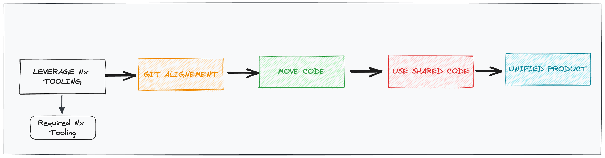

# Move into Monorepo

The into the monorepo is a crucial part of our larger strategy aimed at enhancing the quality and speed of  product development. To understand the comprehensive plan, please refer to the [Global Strategy Documentation](https://vie.git.bwinparty.com/vanilla/monorepo/-/blob/main/docs/global-strategy/global-strategy.md).

They are many benefits of moving code a monorepo. You can find a good explanation at the documentation [Why Monorepos](https://nx.dev/concepts/more-concepts/why-monorepos).




## Leverage Nx Tooling

> More detailed insights can be found in the [leverage-nx-tooling.md](./leverage-nx-tooling.md) document

## Git Alignment & Move Code

### Pre-condition

  1. Make sure git history is clean ([see cleaning git history](#cleaning-git-history))
  2. Archive source repo or ensure code merge is frozen
  3. Close as many PRs as you can
  4. Be sure you are on the main branch up-to-date.

### In source repo

  1. Create a branch `prepare-migration`
  ```bash
  $ git checkout -b prepare-migration
  ```
  2. Create a folder `migration` at the root of your repository
  3. Move all files into the created folder

#### Unix
  ```bash
  $ git mv * migration -k
  $ git mv .* migration -k
  ```
#### Windows
  ```bash
  $ git mv (gci *) migration -k
  $ git mv (gci .*) migration -k
  ```

  4. Remove all files that were not moved because ignored by git: `node_modules`, `dist`, ...
  5. Commit the modifications. Should be only one folder `migration` folder
  ```bash
  $ git add -A
  $ git commit -m "Prepare for monorepo migration"
  ```

### In target monorepo

  1. Create a branch `prepare-migration`
  ```bash
  $ git checkout -b prepare-migration
  ```
  2. Create a folder `migration` at the root of your repository
  ```bash
  $ git remote add -f ${projectName} ../path-to-cloned-repo/
  ```
  3. Merge your `prepare-migration` branch into monorepo
  ```bash
  $ git merge ${projectName}/prepare-migration --no-commit --allow-unrelated-histories
  ```
  4. Start moving files from `migration` to the related locations
  * Check that libraries from your `package.json` present in the monorepo `package.json`
  * Check that the CI is covering the jobs of your CI
  * Check that all root configs are in sync (`eslintrc`, `jest.preset.json`, ...)
  * Move all `migration/packages` folder into root `packages` by using `git mv`
  5. Push and merge your branch to Monorepo

### Move PRs

Once the migration is merged in main, you can follow these steps to recreate your MRs in monorepo:

* in your repo, find hash of commit (let's call it MAIN-COMMIT) that is just before your commits that are related to your MR
* squash all your commits that are part of the MR into one (let's call it MR-COMMIT)
* run `git format-patch MAIN-COMMIT-HASH..MR-COMMIT-HASH`, that will generate a patch file in your repo root
* create a branch in Monorepo
* in monorepo, run `git apply path/to/patch/file` to apply the changes
* now you can commit, push, and recreate the MR in the monorepo

## Use shared Code

Once you are working in the monorepo, you can start using directly libraries like Vanilla instead of using npm packages.

## Cleaning Git History

Using [bfg-repo-cleaner](https://rtyley.github.io/bfg-repo-cleaner/).

> Important: make sure to remove branch protections before to allow force push to main.

1. Clone the repo using --mirror option:

```
git clone --mirror <repo>

cd <repo>
```

2. Update refs to not include merge requests:

```
git config --local --edit
```

3. Add the following lines:

```
push = +refs/heads/*:refs/heads/*
push = +refs/tags/*:refs/tags/*
push = +refs/change/*:refs/change/*
```

4. Cleanup the history:

```
java -jar <pathToBfgJar> --delete-blobs-bigger-than 5M .
java -jar <pathToBfgJar> --delete-files '*.zip' .
java -jar <pathToBfgJar> --delete-folders '.angular' .

git reflog expire --expire=now --all && git gc --prune=now --aggressive
```

5. Push to the origin

```
git push
```