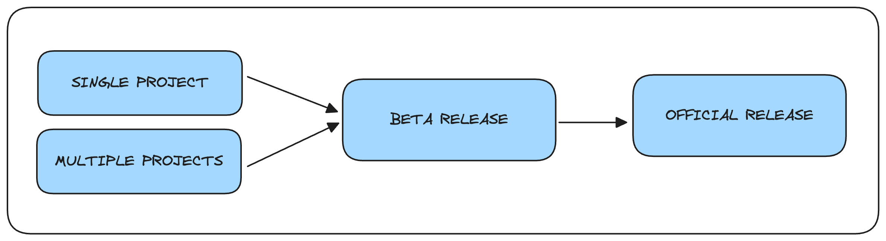
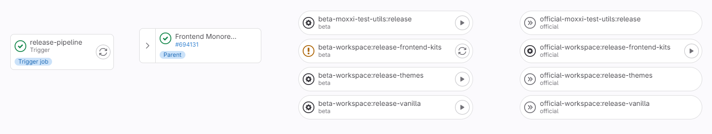
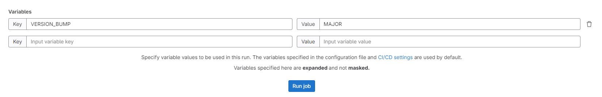

# Release Guidelines

This documentation will cover how to make a release of one or multiple libraries in the monorepo.

It is recommended to always run a beta release before an official one

## Project Configurations

You can find more information about the publish executor and the release executor here: [packages/nx-plugin/README.md](../../packages/nx-plugin/README.md)

## CI

We recommend to execute a release in the pipeline only to avoid unconsistent state in git tags, npm registry, changelog, ...

The list of jobs are automatically created by scanning the monorepo and discovering all release projects/targets.

Each release is a manual execution. You can override the `VERSION_BUMP` by using job parameter:

