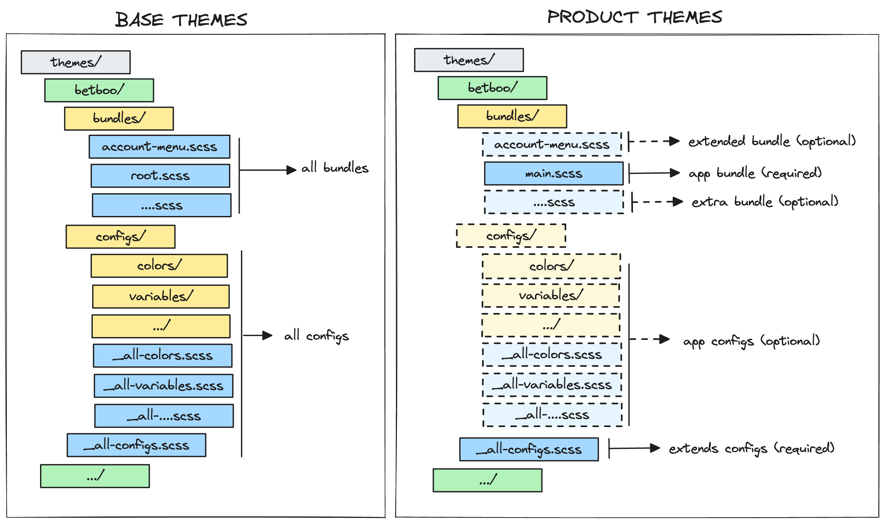
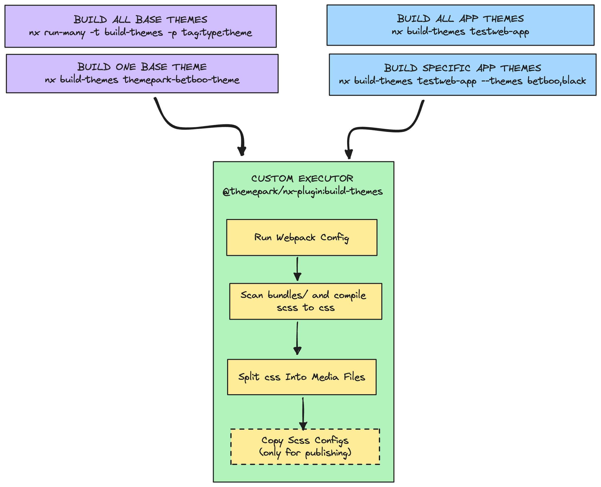
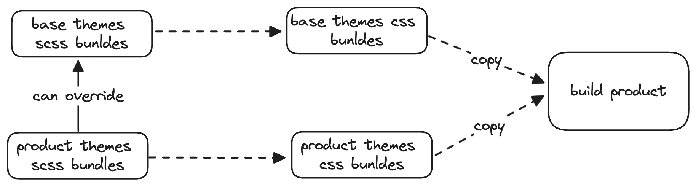
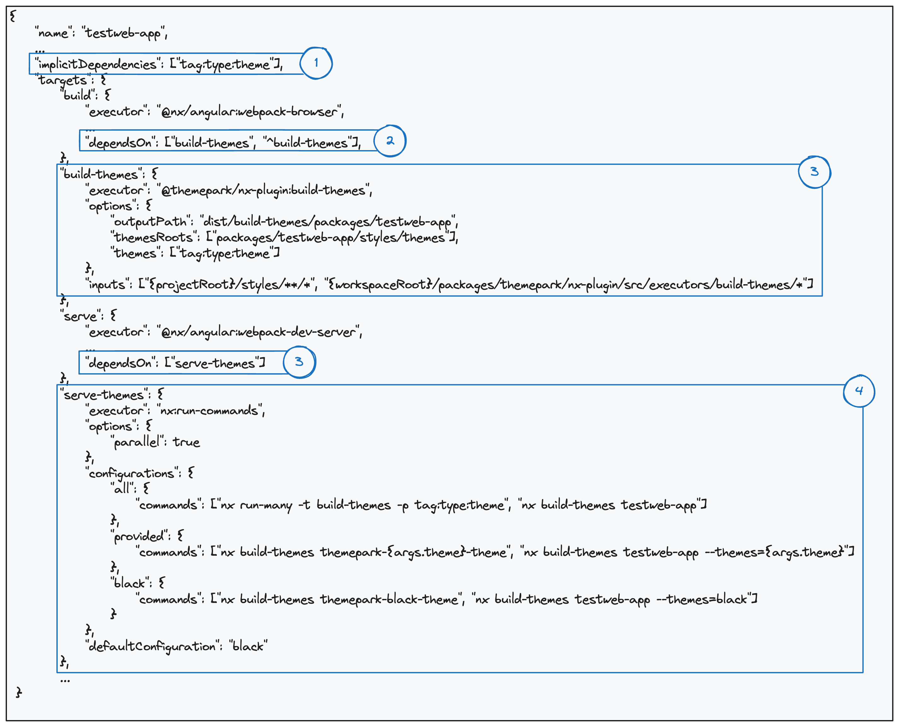

# Themes Guidelines

This documentation will cover how the themes are structure and can be integrated in each application within the monorepo.

To know how the themes can be used within application, please have a look to the [themepark documentation](../packages/themepark/README.md)

## Getting started

### If you want to run an application with the themes, you can...

#### Start your app normally:
```
yarn nx serve testweb-app
```
By default, black theme will be build and integrated.
#### Start your app with all themes related:
```
yarn nx serve testweb-app -c all
```
#### Start your app with a predefine configuration:
```
yarn nx serve themepark-app -c mgm
```
Here, mgm-2 and mgm-3 themes will be build and integrated.

### If you want to watch themes modification and re-build themes only you can:

#### Watch app theme
```
yarn nx serve-themes testweb-app --watch
```
Will watch black themes by default. Meaning if you modify whitelabel, it will also build black because there is an import in black.

#### Watch app theme configuration
```
yarn nx serve-themes themepark-app -c mgm --watch
```
Will watch mgm-2 and mgm-3 themes. You can use configuration specified during the build above.

> Do no hesitate to create you own configuration for the `serve-themes` target

## Themes structure

WHen specifying the themes, it is important to follow a specific structure. This will help to build the themes correctly by staying consistent.



In the monorepo we will have multiple place where themes can be specified:
* In Themepark: these themes are the **Base Themes** that can be published or directly used by the applications.
* In the Products: these theme are the **Product Themes**, so they will include only the styles that belongs to that application. Please see below how an application overrides a **Base Themes** bundle.

They are two part in the structure of each theme:
* The configs: `configs/**/*.scss` files that will contain variables and mixins. Configurations will be grouped, so it is required to have a root `_all-configs.scss` because it will be injected during the build to all bundles.
* The bundles: `bundles/*.scss` files will contain all styles related to one context. Each bundle will be build separately as you can see below.

## How themes are built

In the monorepo, the way the themes are build is aligned. Both the **Base Themes** or the **Product Themes** will use the same executor [`@themepark/nx-plugin:build-themes`](../../packages/themepark/nx-plugin/README.md)



As you can see in the schema, you can build the **Base Themes** and the **Product Themes** in the same way by using the target `build-themes`

## Application Theme Integration

The themes are build using different process and then integrated in the app:



### Nx Project Configuration

To be able to integrate the themes automatically in your build process, you'll need to adapt your project configuration:



#### Build Application

1. The project should declare the **Base Themes** that it is using:
    * `["tag:type:theme"]`: all of them
    * `["themepark-black-theme, themepark-betboo-theme"]`: provided list
2. When running the build target of the application, then it will trigger 2 others targets:
    * `"build-themes"`: call the target to build the **Product Themes**
    * `"^build-themes"`: call the target to build the dependency **Base Themes** declare in the `implicitDependencies`
#### Serve Application

3. When running the serve target of the application, then it will trigger only the `serve-themes` target.
4. The `serve-themes` target will allow to not build all themes but only the themes specified in the configurations

### Webpack Configuration

In the Webpack configuration, you can now simply specify the paths containing the outputs of the build of the themes:

```typescript
import { createWebpackConfig } from '@frontend/dev-kit';

export default createWebpackConfig({
    themesOutputPaths: ['dist/build-themes/packages/themepark/themes', 'dist/build-themes/packages/testweb-app'],
});

```