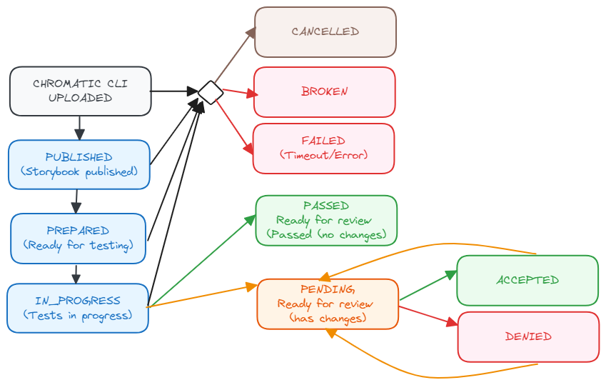

# Chromatic Webhook - Request Handler

This packages covers the logic for requests received via chromatic.

As we have a custom gitlab integration, only build webhooks are supported (no reviews) and implemented.

## Webhook Statuses

These are the webhook statuses received from chromatic:

The following mapping to gitlab applies:
* blue: running
* brown: canceled,
* red: failed,
* yellow: pending
* green: success

### Gitlab Caveats 
Note that webhooks can be received out of order.

Gitlab does not allow to transition between certain states:
* from pending to pending
* from running to pending
* from running to running

This will be reflected by following messages: 
* `Cannot transition status via :enqueue from :pending (Reason(s): Status cannot transition via "enqueue")`
* `Cannot transition status via :enqueue from :running (Reason(s): Status cannot transition via "enqueue")`
* `Cannot transition status via :run from :running (Reason(s): Status cannot transition via "run")`

In order to avoid such messages we set the status to failed before submitting a new status.
